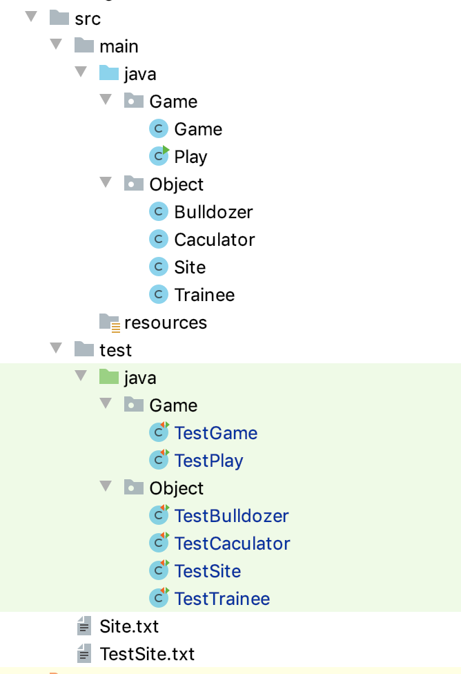
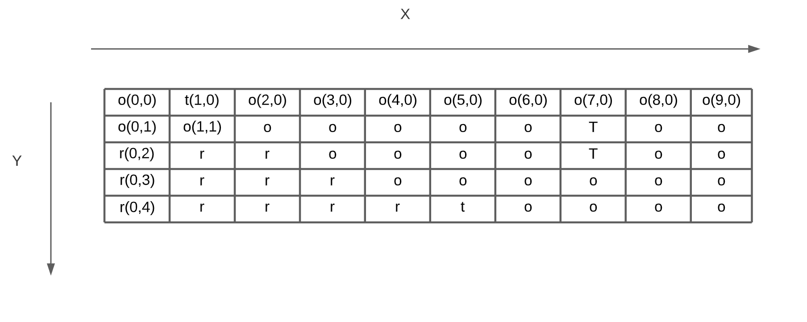
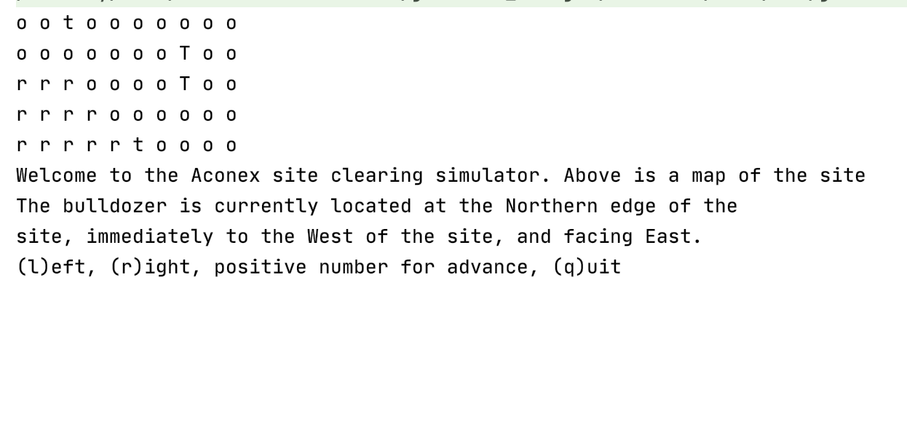
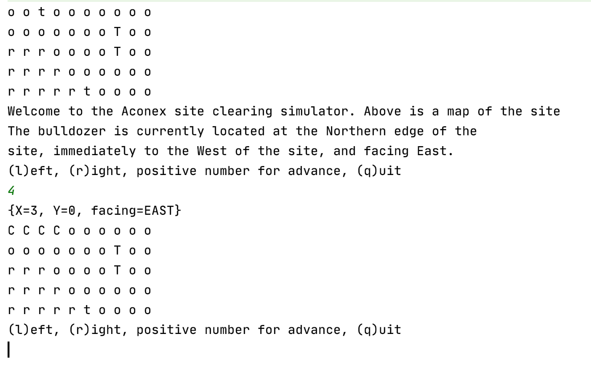
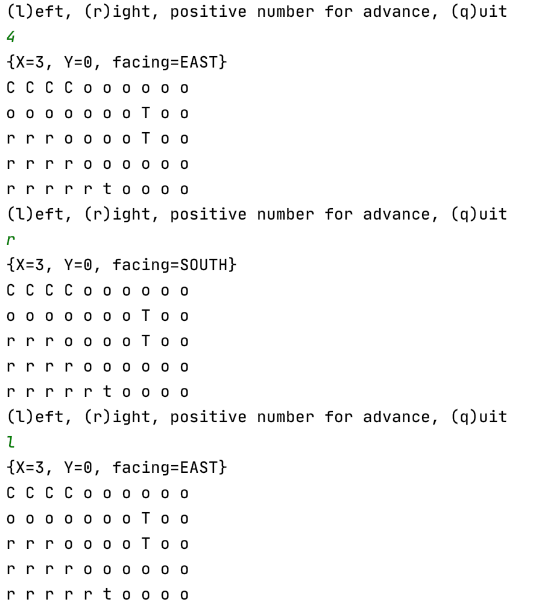
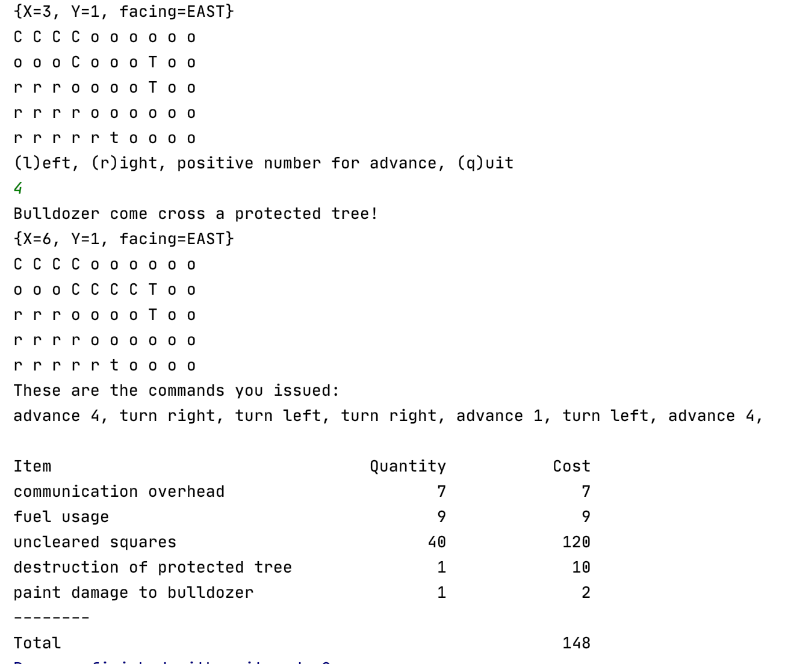
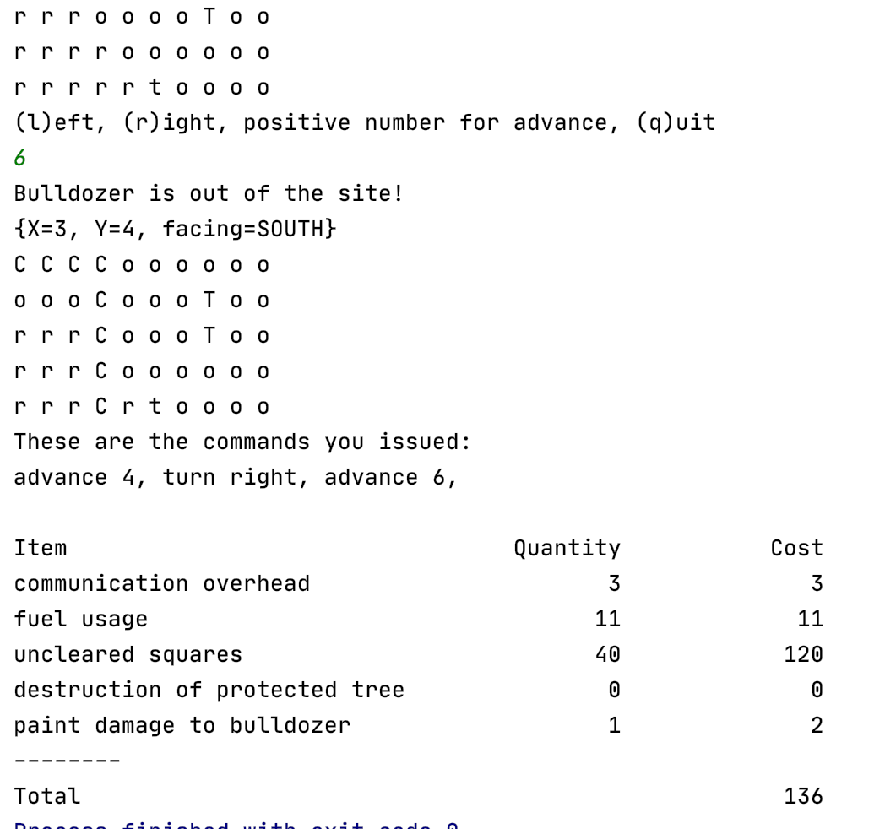
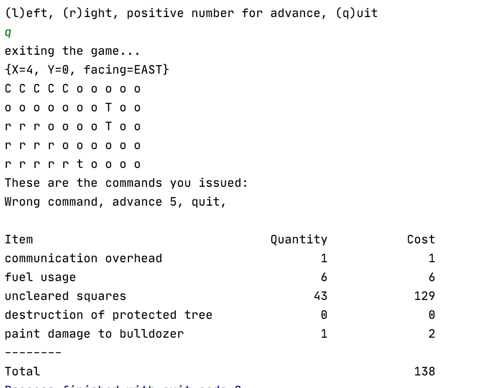
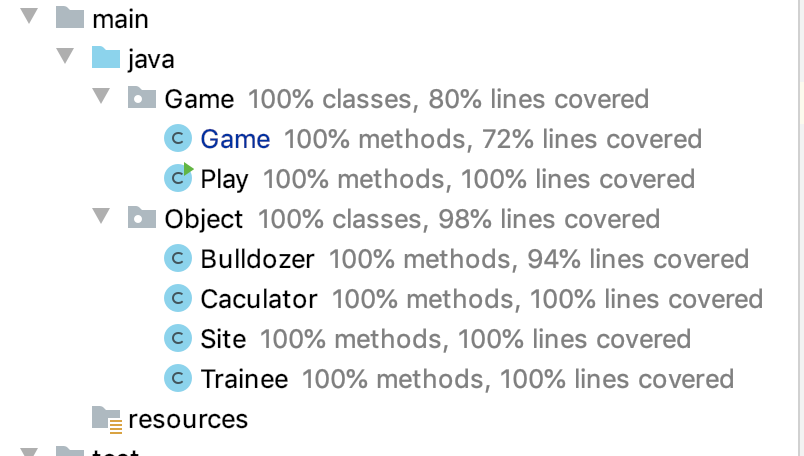

# Site-Clearing-Simulation
## 1.Introduction
The application is a simulation of a bulldozer moving on a square site, dimensions 10 units x 5 units.
There are 4 types of the land, p is for plain land, r for rock land, t for a land contains a movable tree, T for contaning removable tree.

### Technical stack:
- Project management tool: Maven 4.0
- JDK Version: Java 8
- Dependencies: JUnit 5

## 2.File structure

**Game Folder**
- Play: contains main method , do some initialization and run the programme.
- Game: this class contains the process of starting game, playing game and exiting game.

**Object Folder**
- Bulldozer: advance, turn method for command execution, record bulldozer's position, times of paint damage and protected tree if come across.
- Site: read the site map to an arraylist, print the map, provide the information of what kind of land bulldozer come across.
- Trainee: record input command by trainee, transfer abbrev command to full command, print all input command before quitting game.
- Caculator: caculate all the cost using number provided by bulldozer, site, and trainee, do all caculations and print table in the end.

- test folder: all the unit/integration test for all above.
- Site.txt: site information.
- TestSite.txt: site information for testing.

## 3. How to use
Download the zip file in this page, unzip the file and open the folder in IntelliJ(or other IDE). 

Directly run the main method in Game Folder, Play class. 

Or open the terminal, and run the following command: 

**mvn exec:java -Dexec.mainClass="Game.Play"**

Every block of the site has been record in coordinate，as below

### After running the programm, you would see:

### First enter a positive number for advance, after enter 4, cleared block have been set to C, position is also show after the command

### enter "l" for turn left, "r" for turn right

### when bulldozer come cross a protected tree, programe would print "Bulldozer come cross a protected tree!" exit the game, and show the cost table.

### when bulldozer step over the border, programe would print "Bulldozer is out of the site!" exit the game, and show the cost table.

### enter wrong command, you would see "Please enter the right command", and enter q for quiting the game, and show the cost table.

### run all the test with coverage and see the result:

